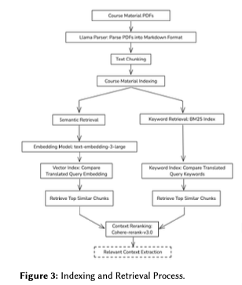
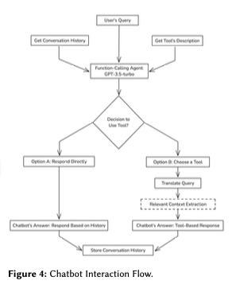

# BiWi AI Tutor: AI-Powered Educational Chatbot

The BiWi AI Tutor is an advanced educational chatbot designed to provide scalable, personalized learning support for higher education students. Developed as part of the tech4compKI initiative funded by the German Federal Ministry of Education and Research, this system leverages large language models (LLMs) and retrieval-augmented generation to deliver context-aware responses to student queries.

---

## Project Overview

### Key Features:

- **Intelligent Chatbot**: Utilizes LangChain and LangGraph to handle complex queries.

- **Document Retrieval**: Fetches and processes course materials to provide context-aware answers.

- **Document Reranking**: Employs Cohere for efficient document reranking and filtering.

- **Multi-Model Support**: Integrates multiple models including OpenAI gpt-4o-mini and Cohere rerank-v3.0.

- **Web Interface**: User-friendly interface built with Streamlit for seamless interactions.

- **API Access**: Exposes FastAPI endpoints for integrating the chatbot into other applications.

- **Evaluation Tools**: Scripts for evaluating the chatbot's performance against predefined datasets.

- **Mentoring Support**: Chatbot can provide mentoring by following specific instructions and guidelines set by the teaching staff to assist students effectively.

### Educational Context:
The chatbot addresses the challenge of scalable mentoring in higher education by acting as a virtual expert on course content and organizational information. It supports students in:
- Clarifying problematic situations
- Planning and monitoring learning progress
- Receiving feedback on writing tasks

---

## Technical Architecture

### 1. Learning Material Indexing & Retrieval

*Figure 3: Indexing and Retrieval Process*

**Process Steps:**
1. **Material Parsing**: Convert PDFs to structured text using Llama Parser
2. **Text Chunking**: Divide content into 1024-token segments with 20-token overlap
3. **Vector Embeddings**: Generate semantic embeddings using OpenAI's text-embedding-3-large
4. **Hybrid Search**: Combine semantic (Vector Index) and keyword (BM25) retrieval
5. **Context Reranking**: Prioritize relevant chunks using Cohere's reranker model

### 2. Chatbot Interaction Flow

*Figure 4: Chatbot Interaction Flow*

**Key Components:**
- **Conversation History**: Maintains context using 10-message history
- **Tool Selection**: LangChain Function Calling Agent for dynamic tool use
- **Context-Aware Generation**: Combines retrieved context with LLM reasoning
- **Multi-Turn Handling**: Iterative loop for complex queries

---

## Technology Stack

### Core Components:
- **LLM Engine**: OpenAI GPT-3.5-turbo (fine-tuned for education)
- **Retrieval System**: LangChain with hybrid indexes
- **Reranking**: Cohere reranker-v3.0 model
- **Text Parsing**: LlamaIndex with Llama Parser
- **Observability**: LangSmith tracking

### Infrastructure:
- **Backend**: Dockerized FastAPI service
- **Frontend**: React-based chat interface
- **Database**: PostgreSQL for conversation history
- **Monitoring**: Prometheus + Grafana
- **Embeddings**: OpenAI text-embedding-3-large

---

## Performance Evaluation

| Category           | Human Evaluation Accuracy | GPT-4 Evaluation Accuracy |
|--------------------|---------------------------|---------------------------|
| Lecture Content    | 80%                       | 85%                       |
| Seminar Material   | 75%                       | 75%                       |
| Organizational     | 85%                       | 85%                       |

**Key Results:**
- Achieved 87% overall correct response rate
- Perfect agreement (100%) with human evaluations on organizational questions
- Reranker implementation improved accuracy by 15% in subsequent tests

---

## Key Innovations

- **Hybrid Retrieval System**: Combines semantic and keyword search
- **Dynamic Context Reranking**: Improves relevance of retrieved content
- **Multi-Turn Conversation Handling**: Maintains context across interactions
- **Tool-Based Architecture**: Modular design for easy expansion
- **Adaptive Response Generation**: Context-aware answer formulation

---

## Future Development

### Planned Features:
- **Personalized Learning Paths**: Generate adaptive learning recommendations
- **Bias Mitigation**: Implement fairness-aware response generation
- **Hybrid Deployment**: Offer on-premise installation options

### Research Directions:
- Benchmarking open-source LLMs vs proprietary models
- Development of explainable AI components
- Integration with Learning Management Systems (LMS)
- Longitudinal studies on student engagement

---

### Prerequisites:
- Python 3.9+
- Docker
- OpenAI API key
- Cohere API key

